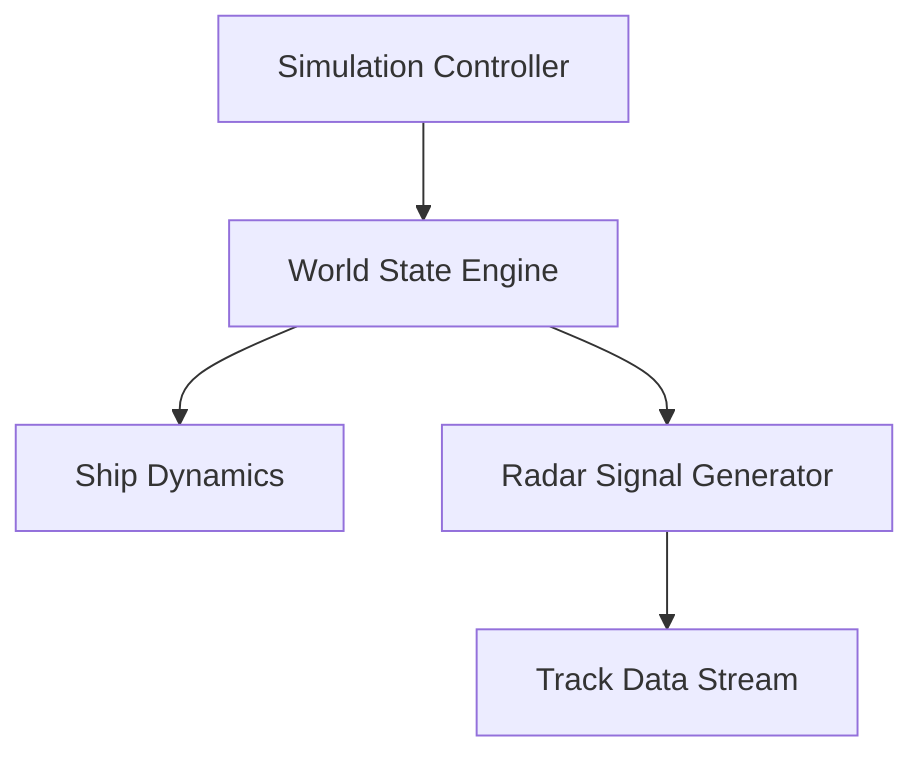

# 🧠 ANTARES Simulator

> The core of the platform: a high-fidelity, real-time radar simulation engine built for performance, extensibility, and operational realism.  
{: .prompt-info }

## 🎯 Purpose

The simulator models **naval radar operations** in dynamic maritime scenarios, supporting both training and system integration efforts.  
It enables reproducible experiments, behavior analysis, and real-time radar tracking.

## 🔄 Architecture Overview

- **Built in Rust**: Ensures high performance, type safety, and memory security.
- **Command-Driven**: Controlled via TCP messages for full integration flexibility.
- **Event Loop Core**: Uses a time-stepped loop to simulate real-world radar behavior.
- **Data Broadcast**: Publishes `Track` objects in real-time to subscribers (via TCP or WebSocket).

> Track data can be consumed by GUI clients, automated systems, or external C4I modules.
> {: .prompt-tip }

## 📦 Use Cases

* 🧭 **Officer Training Simulations**
  Build realistic operational scenarios without physical deployments.

* 🔍 **Sensor Behavior Testing**
  Validate how detection algorithms react under different vessel configurations.

* 🧪 **System Integration & Interoperability**
  Emulate radar behavior to test communication with external systems (e.g., CMS, C4I).

* 🧰 **Research and Development**
  Rapidly prototype and validate new tracking algorithms or radar control strategies.

## 🛠️ Configuration

Simulation parameters are defined via structured TOML or TCP commands.
Entities are configurable with:

* Initial position, heading, and velocity
* Radar range, scan rate, and update interval
* Behavioral strategies and decision logic

> Ships and radars can be added, modified, or removed at runtime.
> {: .prompt-info }

## Learn More

For source code, contributions, or in-depth technical details, visit the GitHub repository:  
👉 [https://github.com/TheSoftwareDesignLab/ANTARES/antares](https://github.com/TheSoftwareDesignLab/ANTARES/antares)

