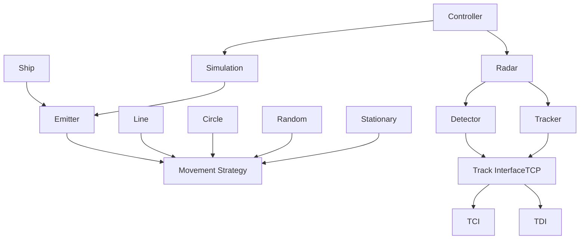

## 🎯 Purpose

The simulator models **naval radar operations** in dynamic maritime scenarios, supporting both training and system integration efforts. It enables reproducible experiments, behavior analysis, and real-time radar tracking.

## 🔄 Architecture Overview

ANTARES follows a modular design centered around two main subsystems: **Simulation** and **Radar**, coordinated by a central **Controller**.

### **Core Components**

**🎛️ Controller**  
Acts as a unified facade managing both simulation and radar subsystems. Provides centralized control for initialization, execution, and coordination between components.

**🌊 Simulation Subsystem**  
- **Emitters**: Generate radar signals within the environment (e.g., ships, buoys)
- **Ships**: Moving or stationary vessels that emit trackable signals
- **Movement Strategy**: Implements the Strategy Pattern to decouple movement logic from entities, supporting:
  - **Line**: Linear movement with constant heading
  - **Circle**: Circular patrol patterns
  - **Random**: Unpredictable movement within boundaries
  - **Stationary**: Fixed position entities

**📡 Radar Subsystem**  
- **Detector**: Captures raw signals from emitters, filters by operational range, and calculates distance/direction to generate individual plots
- **Tracker**: Processes multiple plots over time to establish coherent tracks, calculating target velocity and trajectory

**🔗 Track Interface (TCP)**  
- **TCI (Track Control Interface)**: Receives control commands from external systems for runtime radar adjustments
- **TDI (Track Data Interface)**: Transmits detected tracks and associated data to connected systems for analysis

### **Design Philosophy**

- **High Performance**: Built in Rust for type safety, memory security, and concurrent execution
- **Extensibility**: Strategy Pattern enables easy addition of new movement behaviors without architectural changes  
- **Real-Time Operation**: Event-driven loop ensures sub-10ms latency for live tracking scenarios
- **Integration-Ready**: TCP-based interfaces support seamless connection with C4I and Combat Management Systems

> The modular architecture allows components to operate independently while maintaining tight integration for real-time performance.
{: .prompt-tip }

## 📦 Use Cases

* 🧭 **Officer Training Simulations**: Build realistic operational scenarios without physical deployments.

* 🔍 **Sensor Behavior Testing**: Validate how detection algorithms react under different vessel configurations.

* 🧪 **System Integration & Interoperability**: Emulate radar behavior to test communication with external systems (e.g., CMS, C4I).

* 🧰 **Research and Development**: Rapidly prototype and validate new tracking algorithms or radar control strategies.

## 🛠️ Configuration

Simulation parameters are defined via structured TOML or TCP commands. Entities are configurable with:

* Initial position, heading, and velocity
* Radar range, scan rate, and update interval
* Behavioral strategies and decision logic

> Ships and radars can be added, modified, or removed at runtime.
{: .prompt-info }

## Learn More

For source code, contributions, or in-depth technical details, visit the GitHub repository:  
👉 [https://github.com/TheSoftwareDesignLab/ANTARES/tree/main/antares](https://github.com/TheSoftwareDesignLab/ANTARES/tree/main/antares)

